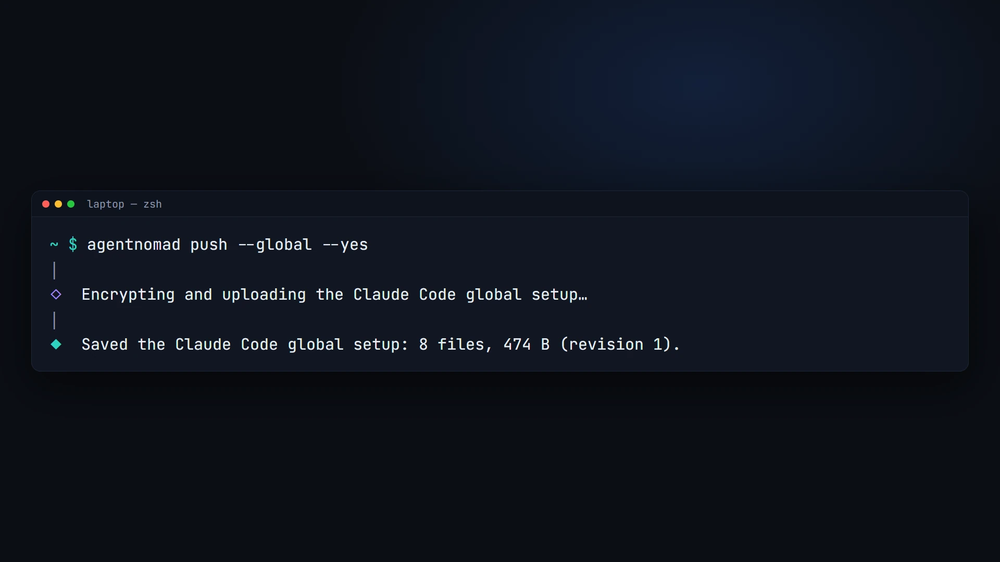
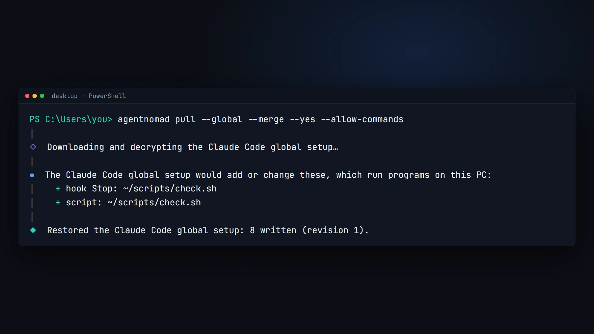
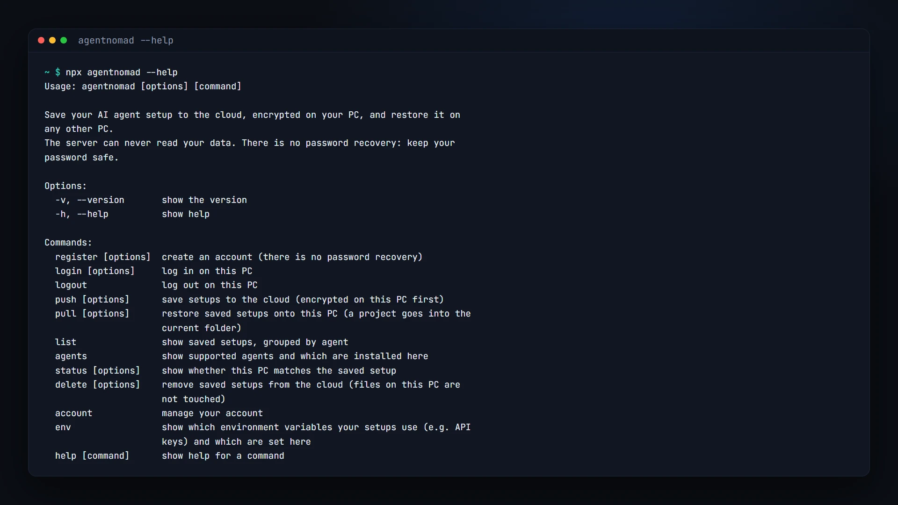

# agentnomad

[](https://www.npmjs.com/package/agentnomad)
[](https://github.com/A1X6/agent-nomad/actions/workflows/ci.yml)
[](LICENSE)

**Take your AI coding agent's setup to any PC, encrypted.** Save your Claude Code setup
(settings, instructions, skills, subagents, commands, hooks, MCP servers, plugins) from one
machine and restore it on another in one command, on macOS, Linux and Windows. It is
encrypted on your PC first: the server can never read it.

<p align="center">
  
</p>

```sh
# On your laptop
agentnomad register
agentnomad push

# On any other PC
agentnomad login
agentnomad pull
```

> **Status:** 1.0 supports Claude Code. More agents are next: see the [roadmap](#roadmap).

## See it work

**Push** on the PC that has your setup: it is collected, encrypted on the PC and uploaded.



**Pull** on any other PC, here Windows: anything that would run programs is listed first,
then the setup is restored with this PC's paths.



Every command, with `agentnomad --help`:



## Why

Rebuilding an agent setup by hand on every new machine is slow, and copying folders breaks:
paths differ between PCs and operating systems, secrets leak, and machine state (logins,
history, caches) comes along. agentnomad copies exactly the setup, rewrites paths for the
new PC, and shows you anything that would run programs before writing it.

## Features

- **Global and per-project setups.** Your `~/.claude` setup, and each project's
  `CLAUDE.md`, `.mcp.json` and `.claude/` folder, saved and restored separately.
- **Zero-knowledge.** Encrypted on your PC with a key derived from your password
  (Argon2id, XChaCha20-Poly1305). The server stores ciphertext only; even project names are
  hidden. There is no password recovery, which is what keeps it that way.
- **Works across operating systems.** Home paths are rewritten for the other PC, line
  endings and permissions are fixed per OS, and hooks that only run on the other OS are
  flagged.
- **Safe restores.** Identical files are left alone; different ones are merged, overwritten
  with a backup, or skipped: you choose, per file or for all. Pull never deletes files.
- **Nothing runs unseen.** Everything new or changed that Claude Code would run is listed and
  confirmed before it is written: hooks, the status line, MCP servers, settings that run a
  command (such as `apiKeyHelper`), the scripts they run, and skills, commands or subagents
  with commands that run by themselves. Commands written in a skill as instructions are never
  flagged.
- **Plugins reinstalled, not copied,** with Claude Code's own `claude plugin` commands.
- **Opt-in memory and secrets.** Include Claude's memory, and save environment variable
  values (such as API keys for MCP servers) inside the encrypted setup.
- **Your claude.ai skills too (opt-in).** Save a copy of the skills you made on claude.ai and
  add them as local skills on a PC that uses another claude.ai account, or none.
- **Scriptable.** Every command runs from a script or CI with flags and clear exit codes.

## Install

agentnomad needs [Node.js](https://nodejs.org) 22.13 or newer.

```sh
npm install -g agentnomad
```

Or run it without installing:

```sh
npx agentnomad pull
```

Every release is built and published by GitHub Actions with
[npm provenance](https://docs.npmjs.com/generating-provenance-statements), so you can check
that the package was built from this repository: `npm audit signatures`.

## Quick start

**1. On the PC that has your setup:**

```sh
agentnomad register   # choose a username and a strong password (no recovery!)
agentnomad push       # pick agents and scopes: global setup, this project, or both
```

Run `agentnomad push` inside a project folder to save that project's setup too. The first
time, you name the project; other PCs pick it by that name.

**2. On another PC:**

```sh
agentnomad login
agentnomad pull       # restores the global setup, or a project into the current folder
```

**3. Later:** run `push` after changing your setup and `pull` on the other PCs.
`agentnomad status` tells you whether this PC is up to date.

## Commands

| Command                     | What it does                                                                                   |
| --------------------------- | ---------------------------------------------------------------------------------------------- |
| `agentnomad register`       | Create an account (there is no password recovery).                                             |
| `agentnomad login`          | Log in on this PC.                                                                             |
| `agentnomad logout`         | Log out on this PC.                                                                            |
| `agentnomad push`           | Save setups to the cloud, encrypted on this PC first.                                          |
| `agentnomad pull`           | Restore saved setups onto this PC; a project goes into the current folder.                     |
| `agentnomad list`           | Show saved setups, grouped by agent, with revision, size and age.                              |
| `agentnomad status`         | Show whether this PC matches the saved setups.                                                 |
| `agentnomad delete`         | Remove saved setups from the cloud (files on your PCs are not touched).                        |
| `agentnomad account delete` | Delete your account and every saved setup.                                                     |
| `agentnomad agents`         | Show supported agents and which are installed here.                                            |
| `agentnomad env`            | Show which environment variables your setups use, and which are set here (never their values). |

Run `agentnomad <command> --help` for every option.

### Flags

| Flag                                       | Commands                                            | Meaning                                                                                                                                          |
| ------------------------------------------ | --------------------------------------------------- | ------------------------------------------------------------------------------------------------------------------------------------------------ |
| `--agent <ids>`                            | push, pull, status, delete                          | Agents to use, comma-separated (e.g. `claude-code`).                                                                                             |
| `--global`                                 | push, pull, status, delete                          | The global setup (`~/.claude`).                                                                                                                  |
| `--project <name>`                         | push, pull, status, delete                          | A project setup, by the name it was saved under.                                                                                                 |
| `--memory` / `--no-memory`                 | push                                                | Include Claude's memory, or not.                                                                                                                 |
| `--account-skills` / `--no-account-skills` | push, pull                                          | Push: save a copy of your own claude.ai skills. Pull: add them as local skills (for a PC without that claude.ai account).                        |
| `--merge` / `--overwrite`                  | pull                                                | One answer for every existing file (overwrite keeps a backup).                                                                                   |
| `--allow-commands`                         | pull                                                | Accept new hooks, MCP servers, scripts and anything else that runs, and install plugins and programs, without asking. Only for setups you trust. |
| `-y`, `--yes`                              | push, pull, delete, register, login, account delete | Accept the safe defaults instead of asking. It never accepts new commands or installs.                                                           |
| `--username <name>`, `--password-stdin`    | register, login, account delete                     | Log in from a script; the password is read from standard input.                                                                                  |

### From scripts and CI

With no terminal, agentnomad never asks: a question the flags do not answer stops the
command with exit code 1 and names the flags to add. Push and pull look for every such
question before they change anything, so a script never stops halfway.

```sh
echo "$AGENTNOMAD_PASSWORD" | agentnomad login --username me --password-stdin
agentnomad pull --global --merge --yes
```

Exit codes: `0` done, `1` failed (or an answer was needed), `130` cancelled.

## What is synced

|                          | Synced                                                                                                                                                                           | Never synced                                                                                                                         |
| ------------------------ | -------------------------------------------------------------------------------------------------------------------------------------------------------------------------------- | ------------------------------------------------------------------------------------------------------------------------------------ |
| **Global** (`~/.claude`) | `settings.json`, `CLAUDE.md`, `keybindings.json`, `rules/`, `skills/`, `commands/`, `agents/`, `workflows/`, `output-styles/`, `themes/`, scripts your hooks and status line run | Credentials, history, transcripts, sessions, caches, backups, `settings.local.json`, `skills/synced/` (claude.ai syncs those itself) |
| **`~/.claude.json`**     | Your MCP servers and documented preferences, merged in                                                                                                                           | Your login, project list, usage and onboarding state                                                                                 |
| **Plugins**              | Which plugins and marketplaces you use (reinstalled on the other PC)                                                                                                             | Plugin files and caches                                                                                                              |
| **Project**              | `CLAUDE.md`, `CLAUDE.local.md`, `AGENTS.md`, `.mcp.json`, `.worktreeinclude`, `.claude/` settings and folders, scripts the project's hooks run                                   | Your code, `.env`, `.git`, `.claude/agent-memory-local/`, `.claude/worktrees/`                                                       |
| **Opt-in**               | Memory (subagent and auto memory), environment variable values, a copy of your own claude.ai skills (`--account-skills`; never Anthropic's or your organization's)               |                                                                                                                                      |

Settings your organization manages on a PC are never synced; agentnomad tells you when they
exist.

## Security

- Your password never leaves your PC. A key derived from it (Argon2id) unlocks a random data
  key, which encrypts every setup with XChaCha20-Poly1305.
- The server stores only ciphertext, a keyed hash of each project name, your username and
  the device name of each login. Automated tests on every OS check that nothing readable
  leaves the PC.
- Your login is kept in the OS keychain (Windows Credential Manager, macOS Keychain, Linux
  Secret Service), or in a file only you can read where there is none.
- Each account keeps at most 100 saved setups and 50 MB, so one account cannot fill the
  service for everyone.
- **There is no password recovery.** If you forget your password, your saved setups cannot
  be opened by anyone, including us.

Details: [SECURITY.md](SECURITY.md) and the [threat model](docs/security/threat-model.md).

## Roadmap

| Stage    | What                                                                                                                                                                                          | Status          |
| -------- | --------------------------------------------------------------------------------------------------------------------------------------------------------------------------------------------- | --------------- |
| **v1**   | Claude Code on macOS, Linux and Windows: global and project setups, plugins, memory, secrets, scripting, cross-OS tests, security review                                                      | Released as 1.0 |
| **v1.x** | More agents: OpenAI Codex CLI, Google Gemini CLI, OpenCode, Cursor, Claude Desktop and others                                                                                                 | Next            |
| **v1.x** | Data-only agents: support a simple agent with a data file, no code                                                                                                                            | Planned         |
| **v2**   | **One setup, every agent:** turn your Claude Code setup into a Codex, Gemini CLI, OpenCode or Cursor setup (instructions, skills, MCP servers, commands), with a preview of what carries over | Planned         |
| Later    | Password change, version history, selective sync, team sharing, dashboard, background sync                                                                                                    | Ideas           |

The full plan is in [docs/ROADMAP.md](docs/ROADMAP.md).

## Documentation

| Document                                                       | For                                                  |
| -------------------------------------------------------------- | ---------------------------------------------------- |
| [docs/ARCHITECTURE.md](docs/ARCHITECTURE.md)                   | How the whole system works, and what every file does |
| [docs/ADDING-AN-AGENT.md](docs/ADDING-AN-AGENT.md)             | Adding support for a new agent                       |
| [docs/ROADMAP.md](docs/ROADMAP.md)                             | What comes next                                      |
| [SECURITY.md](SECURITY.md)                                     | The security model and how to report a vulnerability |
| [docs/security/threat-model.md](docs/security/threat-model.md) | Threats, defences, tests and accepted risks          |
| [CONTRIBUTING.md](CONTRIBUTING.md)                             | Building, testing and contributing                   |
| [docs/decisions/](docs/decisions/)                             | Recorded technical decisions                         |

## Contributing

Issues and pull requests are welcome; start with [CONTRIBUTING.md](CONTRIBUTING.md). Please
report security issues privately, as described in [SECURITY.md](SECURITY.md).

## License

[MIT](LICENSE) © 2026 A1X6
