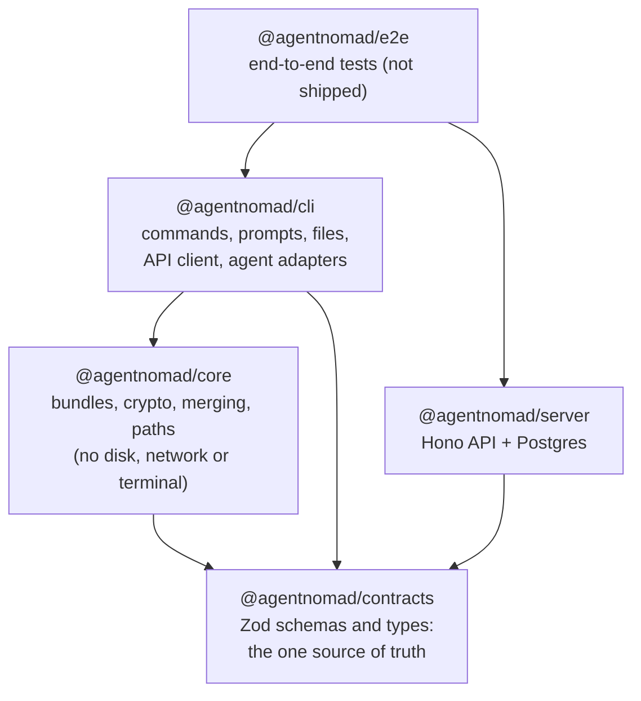
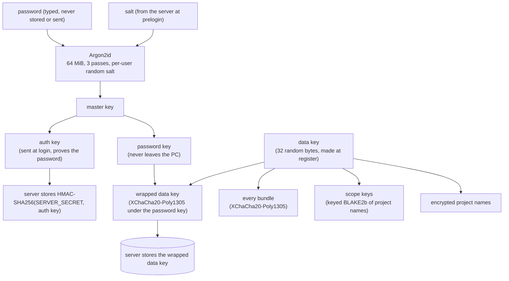
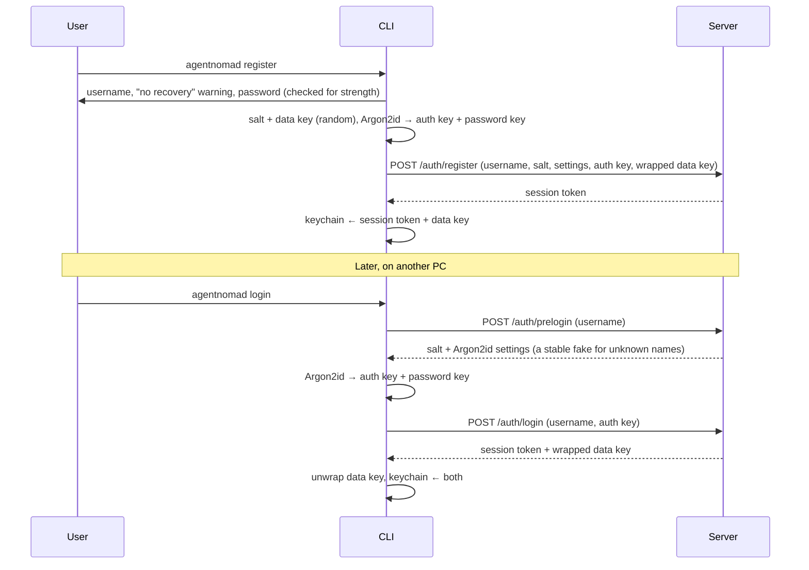
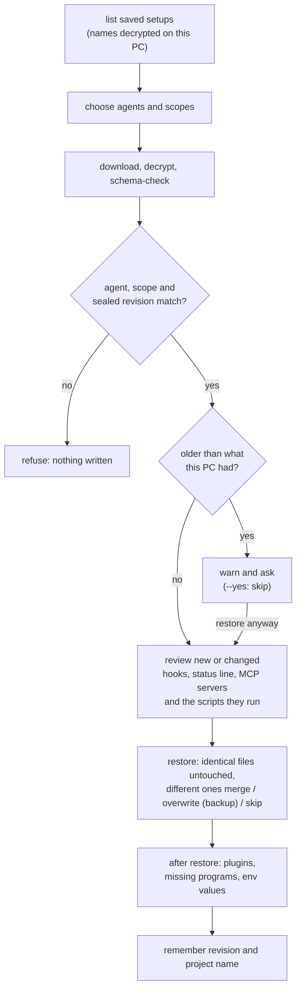

# Architecture

How agentnomad works, end to end, and what every file is responsible for.

- **Part 1** explains the system: the pieces, the keys, the bundle, what each command does,
  the server, and how it is tested.
- **Part 2** is a file-by-file reference.

New here? Read [The big picture](#1-the-big-picture), then [Push](#push) and [Pull](#pull). To add
an agent, see [ADDING-AN-AGENT.md](ADDING-AN-AGENT.md). Security details are in
[security/threat-model.md](security/threat-model.md).

## Contents

- [Part 1 · How the system works](#part-1--how-the-system-works)
  - [1. The big picture](#1-the-big-picture)
  - [2. Packages and how they depend on each other](#2-packages-and-how-they-depend-on-each-other)
  - [3. Keys and encryption](#3-keys-and-encryption)
  - [4. The bundle](#4-the-bundle)
  - [5. What each command does](#5-what-each-command-does)
  - [6. Agent adapters](#6-agent-adapters)
  - [7. The Claude Code adapter](#7-the-claude-code-adapter)
  - [8. The server](#8-the-server)
  - [9. What the CLI keeps on a PC](#9-what-the-cli-keeps-on-a-pc)
  - [10. Running from scripts and CI](#10-running-from-scripts-and-ci)
  - [11. Tests, CI and deployment](#11-tests-ci-and-deployment)
  - [12. Design rules](#12-design-rules)
- [Part 2 · File reference](#part-2--file-reference)

---

# Part 1 · How the system works

## 1. The big picture

agentnomad copies an AI coding agent's setup (settings, instructions, skills, subagents,
commands, hooks, MCP servers, plugins, optional memory) from one PC to another, through a
server that can never read it.

```mermaid
flowchart LR
  subgraph PCA["PC A (e.g. macOS)"]
    A1["~/.claude and project files"] --> A2["collect"]
    A2 --> A3["make paths portable<br/>({{HOME}})"]
    A3 --> A4["compress + encrypt<br/>(data key)"]
  end
  subgraph Server["agentnomad API (Render + Neon)"]
    S1[("bundles: ciphertext<br/>+ metadata only")]
  end
  subgraph PCB["PC B (e.g. Windows)"]
    B1["decrypt + decompress"] --> B2["check: agent, scope,<br/>revision"]
    B2 --> B3["review commands<br/>that run programs"]
    B3 --> B4["restore with this PC's<br/>paths, merge or overwrite"]
    B4 --> B5["reinstall plugins,<br/>offer programs, env values"]
  end
  A4 -- "HTTPS, ciphertext only" --> S1
  S1 -- "ciphertext" --> B1
```



The rules that shape everything else:

1. **Encryption happens on the PC.** The server stores ciphertext and a little metadata. It
   never sees a file, a project name, a password or a key that could open them.
2. **One password, any PC.** Logging in on a new PC with the same password unlocks
   everything; there is no password recovery, because recovery would mean the server could
   open the data.
3. **One bundle per agent and scope.** A "scope" is the agent's global setup, or one
   project. Each is saved, versioned and restored on its own.
4. **Agents are plug-ins.** Everything agent-specific lives in an adapter. Push, pull,
   encryption and the server do not know what Claude Code is.
5. **Nothing runs without being shown.** Anything restored that runs programs (hooks, the
   status line, MCP servers, the scripts they run, plugins, npm packages) is listed and
   asked about first.

## 2. Packages and how they depend on each other

A pnpm monorepo of five TypeScript packages (strict mode, ES modules, Node 22.13 or newer).



| Package     | Responsibility                                                                                                                                                                                                               | Talks to               |
| ----------- | ---------------------------------------------------------------------------------------------------------------------------------------------------------------------------------------------------------------------------- | ---------------------- |
| `contracts` | Every shape that crosses a boundary: API requests and responses, the bundle format, limits, error codes. Validated at runtime with Zod on both sides.                                                                        | nothing                |
| `core`      | Pure logic: key derivation, encryption envelopes, the bundle codec, project-name hashing, path portability, merge strategies. Takes everything it needs as arguments (OS, home folder), so every OS can be tested on any OS. | nothing (no Node APIs) |
| `cli`       | The `agentnomad` command. Reads and writes files, asks questions, keeps secrets in the OS keychain, calls the API, and holds the agent adapters.                                                                             | the API over HTTPS     |
| `server`    | The API: accounts, sessions, encrypted bundles, rate limits. Knows nothing about agents or files.                                                                                                                            | Postgres (Neon)        |
| `e2e`       | Runs the built CLI as a script against a local copy of the API, across operating systems.                                                                                                                                    | local only             |

The server and the CLI never import each other; they only share `contracts`. So a change to
the API shape is a change in one place, checked on both sides.

## 3. Keys and encryption



- **Register:** the CLI makes a random salt and a random **data key**, derives the master
  key from the password with Argon2id, splits it into an **auth key** and a **password
  key**, wraps the data key with the password key, and sends the username, salt, Argon2id
  settings, auth key and wrapped data key. The server stores a keyed hash of the auth key.
- **Login on any PC:** prelogin returns the salt and settings; the same password gives the
  same keys; the server checks the auth key and returns the wrapped data key, which only
  the password key can open. The data key and a session token are then kept in the OS
  keychain.
- **Why two keys:** changing the password only re-wraps the small data key; bundles never
  need re-encrypting.
- **Bundles** are sealed with XChaCha20-Poly1305 (a fresh random 24-byte nonce each time).
  The associated data binds the format version, the agent and the scope key, so a bundle
  served under another agent or scope fails to open.
- **Project names** never reach the server readable: the server sees a scope key (a keyed
  hash, the same on every PC) and an encrypted name only the user's PCs can read.
- **Key formats are versioned.** Labels such as `agentnomad/scope-key/v1` and the KDF
  context are part of the stored format and never change in place; a new scheme is added
  next to the old one.

The server has its own secret, `SERVER_SECRET`, which keys the auth-key hashes, the fake
salts returned for unknown usernames, and the pseudonyms in rate-limit rows. It lives only
in the host's settings, never in the database.

## 4. The bundle

A bundle is one agent's setup for one scope, as plain data before encryption:

| Field           | Meaning                                                                                                         |
| --------------- | --------------------------------------------------------------------------------------------------------------- |
| `formatVersion` | `1`. Readers refuse any other version.                                                                          |
| `agent`         | e.g. `claude-code`.                                                                                             |
| `scope`         | `{ kind: 'global' }` or `{ kind: 'project', name }`.                                                            |
| `sourceOs`      | `darwin`, `linux` or `win32`: where it was saved, to flag hooks that only run there.                            |
| `agentVersion`  | e.g. Claude Code `2.1.282`; pull warns when this PC runs an older one.                                          |
| `revision`      | The revision this copy is saved as, sealed inside so a server cannot pass an older copy off as the current one. |
| `files`         | Every file: a relative forward-slash path, `executable`, and content as UTF-8 text or base64.                   |

**Portable paths.** In text files, the user's home folder is replaced by `{{HOME}}` on push
(a `{{HOME}}` already written in a file is stored as `{{HOME\}}` and comes back unchanged)
and by the other PC's home on pull (with backslashes in `.bat` and `.cmd` files on Windows), so `C:\Users\ana\.claude\hooks\check.sh` in a hook
becomes `/Users/ana/.claude/hooks/check.sh` on a Mac. Paths inside the bundle are relative
to the agent's base folder (global) or the project root (project), never absolute and never
with `..`.

**Reserved entries.** Things that are not plain files of the agent's folder live under
`.agentnomad/` in the bundle:

| Entry                            | What it holds                                                                                   | On pull                                                                                                           |
| -------------------------------- | ----------------------------------------------------------------------------------------------- | ----------------------------------------------------------------------------------------------------------------- |
| `.agentnomad/claude.json`        | Selected `~/.claude.json` keys: MCP servers and documented preferences                          | Merged in by key; the file's login and project state are never touched                                            |
| `.agentnomad/home/...`           | Scripts the hooks or status line run from elsewhere in the home folder, and known tool settings | Written back to the home folder, only if the setup's own hooks run them                                           |
| `.agentnomad/auto-memory/...`    | The project's auto memory (opt-in)                                                              | Written to this PC's memory folder for the project                                                                |
| `.agentnomad/plugins.json`       | Installed plugins and their marketplaces                                                        | Plugins are reinstalled with `claude plugin`, never copied                                                        |
| `.agentnomad/programs.json`      | Programs hooks start, and how npm installed them                                                | Missing ones are offered for install                                                                              |
| `.agentnomad/env.json`           | Environment variable values the user chose to save                                              | Offered for the shell profile; never written as a file                                                            |
| `.agentnomad/account-skills/...` | A copy of the user's own claude.ai skills (opt-in; never Anthropic's or an organization's)      | Offered as local skills in `~/.claude/skills/<name>/`, only on a PC that does not already get them from claude.ai |

**From bundle to bytes:** JSON → gzip → XChaCha20-Poly1305 → upload. The encrypted size is
capped at 5 MB; decompression stops at 64 MB (a guard against decompression bombs); the
result is schema-checked before anything is written.

## 5. What each command does

### Register and login



`logout` ends the session on the server and always forgets it on the PC, even offline.

### Push

1. Detect installed agents; choose agents and scopes (or take `--agent`, `--global`,
   `--project`).
2. A project is named once per folder (remembered in local state); the home folder is never
   offered as a project.
3. Choose whether to include memory (`--memory` / `--no-memory`).
4. Show organization-managed settings and files the adapter does not know yet.
5. The adapter **collects** the files; the user may add saved environment values. Links
   into folders for keys, links out of a project and files over 10 MB are left out, and push
   says so. Every setup is collected and every question asked before the first upload.
6. Paths are made portable, the bundle is built, compressed and **encrypted for the exact
   revision it will become** (the one this PC last knew, plus one).
7. Upload with that expected revision. If another PC saved a newer copy, the server refuses
   (`revision_conflict`): the user is asked whether to replace it (with `--yes`: never), and
   a replacement is encrypted again for the new revision.
8. Remember the new revision for this PC.

If this PC's last pull of a setup left out commands the user declined, pushing it would drop
them for every PC: push asks first, and `--yes` skips it with a note.

### Pull



- Files that only differ in how the home path is written (`C:/` vs `C:\`) are left as they
  are.
- Pull never deletes files.
- `--merge` and `--overwrite` answer every file at once; JSON merges by key (the incoming
  side wins), other text files are kept and the incoming copy is saved next to them.
- `--yes` never accepts new commands, plugin reinstalls or npm installs; `--allow-commands`
  does.

### The other commands

| Command          | What it does                                                                                                                                                      |
| ---------------- | ----------------------------------------------------------------------------------------------------------------------------------------------------------------- |
| `list`           | Every saved setup, grouped by agent, with revision, size and age. Project names are decrypted on this PC.                                                         |
| `status`         | For each saved setup: up to date, newer on the server, never pulled here, or deleted on the server. Uses only the revisions this PC remembers; downloads nothing. |
| `delete`         | Deletes saved setups from the server after confirming; files on the PC are untouched.                                                                             |
| `account delete` | Deletes the account and every setup. Always needs the username and the password (the server checks the auth key), so a stolen session cannot do it.               |
| `agents`         | Supported agents, whether each is installed here, its version and folder, and organization-managed settings.                                                      |
| `env`            | Which environment variables this PC's setups use and whether each is set here. Never shows a value.                                                               |

## 6. Agent adapters

Everything agent-specific sits behind one interface, `AgentAdapter`
(`packages/cli/src/agents/adapter.ts`):

| Part                      | Question it answers                                                                                               |
| ------------------------- | ----------------------------------------------------------------------------------------------------------------- |
| `detector`                | Is the agent installed here? Where is its base folder? Which version?                                             |
| `collector`               | Which files make up the global setup, or a project's setup? (Never credentials or machine state.)                 |
| `restorer`                | Write a pulled setup back: where each file goes, what is refused, per-OS line endings and permissions, conflicts. |
| `inspector` (optional)    | What should the user be told on push or pull (managed settings, files this version does not know yet)?            |
| `afterRestore` (optional) | Follow-up after a pull, such as reinstalling plugins.                                                             |

Adapters are registered in one place, `createAppHandlers` in `packages/cli/src/app.ts`,
through `createAgentRegistry`. Push, pull, `list`, `status`, `delete` and `agents` only use
the registry and these interfaces, so a new agent is a new folder plus one line there. See
[ADDING-AN-AGENT.md](ADDING-AN-AGENT.md).

Data is stored per agent (`agent` is part of every bundle's key), so adding an agent never
touches anyone's existing saves.

## 7. The Claude Code adapter

Base folder: `~/.claude`, or `CLAUDE_CONFIG_DIR` when set.

**Detection.** Installed when the `claude` command is found (PATH, PATHEXT on Windows,
`~/.local/bin` from the native installer) or the base folder exists. The version comes from
`claude --version` (no shell, 5-second limit).

**What is saved.** Every list lives in one data file,
`claude-code-paths.data.ts`, checked against a schema when loaded, so a new Claude Code
file is a one-line change there:

| Scope               | Saved                                                                                                                                                                           | Never saved                                                                                                                                        |
| ------------------- | ------------------------------------------------------------------------------------------------------------------------------------------------------------------------------- | -------------------------------------------------------------------------------------------------------------------------------------------------- |
| Global `~/.claude/` | `settings.json`, `CLAUDE.md`, `keybindings.json`, `rules/`, `skills/`, `commands/`, `agents/`, `workflows/`, `output-styles/`, `themes/`, scripts hooks and the status line run | `.credentials.json`, history, transcripts, sessions, caches, backups, plugin caches, `settings.local.json`, `skills/synced/` (synced by claude.ai) |
| `~/.claude.json`    | Only `mcpServers` and documented preference keys                                                                                                                                | Login, projects, usage and onboarding state                                                                                                        |
| Project root        | `CLAUDE.md`, `CLAUDE.local.md`, `AGENTS.md`, `.mcp.json`, `.worktreeinclude`, scripts the project's hooks run                                                                   | Everything else, including app code, `.env` and `.git`                                                                                             |
| Project `.claude/`  | `settings.json`, `settings.local.json`, `CLAUDE.md`, and the same folders as global                                                                                             | `agent-memory-local/`, `worktrees/`                                                                                                                |
| Opt-in              | Subagent memory, auto memory                                                                                                                                                    |                                                                                                                                                    |

**Restore rules** (`restore-rules.ts`): a file is written only if a collector could have
produced it. A home-folder file must be a known tool's settings or a script the setup's
own hooks or status line run, and never in a folder whose files run by themselves (Startup,
`.config/autostart`, `Library/LaunchAgents`, fish and PowerShell profile folders), so a
bundle cannot drop a file that runs by itself. Refusals ignore case. On Windows, names with
`:`, device names, trailing dots and 8.3 short names are refused. Two entries that differ
only in case or Unicode form are one file on Windows and macOS: only the first is written. An
entry that cannot be written is skipped with a warning; the rest continue. `~/.claude.json`
is only ever merged, with a backup: only `mcpServers` and the preference keys, never
`projects` or account state. It is skipped while Claude Code is running (it rewrites the
file while open) and read again once Claude Code is closed. Auto memory is Markdown only, and
a folder chosen by the project's `autoMemoryDirectory` is used only inside the home folder
and outside refused folders (`auto-memory.ts`).

**Review of runnable things** (`command-review.ts`): everything Claude Code's docs say it
runs, when new or changed compared with this PC, is listed before anything is written: hooks
(commands, and `http` hooks that send data to an address), the status line, settings that
run a command (`apiKeyHelper`, `awsAuthRefresh`, `awsCredentialExport`, `gcpAuthRefresh`,
`otelHeadersHelper`, `fileSuggestion`), loader variables in a settings `env` block
(`NODE_OPTIONS`, `LD_PRELOAD`, …), `bypassPermissions` in global settings and
`enableAllProjectMcpServers`, MCP servers (the whole definition is compared, so a new `env`
or `headersHelper` shows), scripts that commands here or in the bundle run and the scripts
next to them, known tool settings (ccstatusline), and skill, command and subagent files with
commands that run by themselves (`runnable-markdown.ts`: a `` !`command` `` placeholder, a
` ```! ` block, frontmatter `hooks`). Commands written as instructions are never flagged.
Declining skips the files that hold them. Saved environment values that make programs load
code need their own yes, and `--yes` alone never adds them. Everything printed from a bundle
or the server goes through `printable`, so escape sequences are shown, never acted on.

**claude.ai skills (T42, opt-in):** Claude Code downloads the skills of the user's claude.ai
account into `skills/synced/<account>/` and manages that folder; agentnomad never writes
there. `push --account-skills` saves a copy of the user's **own** ones (the folder's
`manifest.json` says `creatorType: user`; Anthropic's and an organization's are never
saved) under `.agentnomad/account-skills/`. On pull they are listed and, after a yes (or
`--account-skills`), written as normal local skills in `~/.claude/skills/<name>/`, skipping
any this PC already gets from claude.ai and never replacing a local skill. A local skill
runs its `!`command`` lines where a synced one does not, so such skills are marked, and a
flag alone adds them only with `--allow-commands`.

**After restore:** plugins are reinstalled with Claude Code's own `claude plugin
marketplace add` and `claude plugin install`; a plugin built by running a command gets its
own question; programs that hooks start and npm installed are offered with
`npm install -g name@version`.

**Keeping up with Claude Code:** files Claude Code adds that the data file does not know
are reported on push (a folder holding a script the hooks or status line run is not: push saves
that script); the Claude Code version is stamped in every bundle; and a weekly
drift check (`.github/workflows/drift-check.yml`) compares the data file with the newest
Claude Code. It reads the official
[.claude directory docs](https://code.claude.com/docs/en/claude-directory), runs a fresh
Claude Code in an empty folder to see what it creates, and collects the changelog entries
about files and setup since the data file's `reviewedVersion`. Anything new goes into one
open GitHub issue labelled `drift`; the fresh install runs with no write permissions.

## 8. The server

A [Hono](https://hono.dev) app on Node, deployed on Render from `main`, with Neon Postgres
through Drizzle.

| Route                              | Needs              | Does                                                                              |
| ---------------------------------- | ------------------ | --------------------------------------------------------------------------------- |
| `GET /health`                      | –                  | Liveness (also wakes the free host).                                              |
| `POST /auth/prelogin`              | –                  | Salt and Argon2id settings; a stable fake for unknown names.                      |
| `POST /auth/register`              | –                  | Creates the account and a session.                                                |
| `POST /auth/login`                 | –                  | Checks the auth key; returns a session and the wrapped data key.                  |
| `POST /auth/logout`                | session            | Ends this session.                                                                |
| `GET /bundles`                     | session            | This user's saved setups (metadata only), newest first, cursor-paginated.         |
| `GET /bundles/:agent/:scopeKey`    | session            | The encrypted bytes, with revision and SHA-256 in headers.                        |
| `PUT /bundles/:agent/:scopeKey`    | session            | Saves a new revision if `expectedRevision` matches; else `409 revision_conflict`. |
| `DELETE /bundles/:agent/:scopeKey` | session            | Deletes one saved setup.                                                          |
| `DELETE /account`                  | session + auth key | Deletes the account; sessions, setups and files go with it.                       |

**Layers:** routes (validation with the contracts, errors, limits) → services
(`auth-service`, `bundle-service`: the rules, free of HTTP) → repositories and the blob
store (Postgres). The composition root `server.ts` wires them from environment settings and
refuses to start if `DATABASE_URL` or `SERVER_SECRET` is missing or weak.

**Tables:** `users`, `sessions` (token hashes only), `bundles` (metadata: agent, scope key,
encrypted name, revision, size, hash, pointer to the current file), `bundle_blobs`
(ciphertext, a random id per upload), `rate_limits` (fixed-window counters, keyed by
pseudonyms). Keeping bytes apart from metadata means `list` never reads ciphertext. A new
upload is stored first, then the revision check switches the pointer, then the old file is
deleted, so two PCs saving at once can never overwrite or delete each other's file.

**Limits and logs:** 30 auth requests per minute per IP, 5 registrations per hour per IP
(an IPv6 address counts by its /64), 10 failed logins per account and 10 wrong-password
account deletes per account per 15 minutes (counted before the check, so parallel guesses
cannot slip past), 120 saves and deletes per account per hour; `429` with `Retry-After`.
Each account keeps at most 100 setups and 50 MB of encrypted bytes (checked before storing
anything and again inside the save's transaction, with the user row locked); over it,
`413 payload_too_large` says which limit. The visitor's IP is Cloudflare's
`CF-Connecting-IP` (`True-Client-IP` when that is missing). About one save in 50 also deletes
files no setup points to that are over an hour old. Logs are one JSON line per request with
a request id, never headers, bodies or query strings; a failed query logs its SQL text, never
its parameters. There are no CORS headers and no cookies.

## 9. What the CLI keeps on a PC

| What                         | Where                                                                                                                                                             | Why                                                                                                                                                        |
| ---------------------------- | ----------------------------------------------------------------------------------------------------------------------------------------------------------------- | ---------------------------------------------------------------------------------------------------------------------------------------------------------- |
| Session token and data key   | OS keychain: Windows Credential Manager, macOS Keychain, Linux Secret Service. Service `agentnomad`, account `<secret>@<server host>`                             | So later commands work without the password; one entry per server                                                                                          |
| The same, without a keychain | `%APPDATA%\agentnomad\secrets.json` or `~/.config/agentnomad/secrets.json`, readable only by the user (600 in a 700 folder; on Windows an ACL for this user only) | Servers, WSL, SSH sessions; the CLI says when it is used. A login saved there while the keychain failed is moved into it once it works again               |
| Local state                  | `state.json` in the same folder                                                                                                                                   | Which name each project folder was saved under, and the last revision this PC pushed or pulled of each setup (for conflicts, `status` and rollback checks) |

`AGENTNOMAD_API_URL` points the CLI at another server (https, or http for localhost).

## 10. Running from scripts and CI

When stdin or stdout is not a terminal, the CLI swaps its prompter for one that never asks:
any question the flags leave open stops the command with exit code 1 and names the flags to
add. Push and pull look for such questions before they change anything: pull downloads and
reviews every setup and checks for files that differ and missing environment values first;
push collects every setup and compares revisions with the server first. Every command can be scripted:

```sh
echo "$PASSWORD" | agentnomad login --username me --password-stdin
agentnomad push --global --project my-app --memory --yes
agentnomad pull --global --yes --allow-commands
```

Exit codes: `0` done, `1` failed or an answer was needed, `130` cancelled. Warnings and
errors go to stderr. Passwords are read only from stdin, never from an argument.

## 11. Tests, CI and deployment

| Layer                | What it covers                                                                                                                                                                                                                                                                                      | Where                      |
| -------------------- | --------------------------------------------------------------------------------------------------------------------------------------------------------------------------------------------------------------------------------------------------------------------------------------------------- | -------------------------- |
| Unit and integration | Every package: schemas, crypto vectors, codec limits, path portability on every OS, merge strategies, adapters against real temp folders, commands with fake servers, the API against PGlite                                                                                                        | `packages/*/test` (Vitest) |
| End to end           | The built CLI, run with no terminal, against the real API code on a local PGlite database: three PCs in sequence (register and push; pull with merge, edit, push; pull with overwrite, stale PC, delete, account delete). Every request is recorded and checked: nothing readable may leave the PC. | `packages/e2e`             |
| Cross-OS             | The same three steps on different machines, the database handed over as an artifact: macOS → Windows → macOS and Linux → Windows → Linux                                                                                                                                                            | `.github/workflows/ci.yml` |

CI runs `pnpm check` (typecheck, lint, format, tests) on macOS, Linux and Windows with
Node 22.13 and 24, the real Linux keychain (GNOME Keyring), and the two cross-OS chains.
On every OS and Node version it also builds the npm package, installs it globally, and runs
the e2e steps with the installed `agentnomad` command. Actions are pinned by commit.

**The npm package.** `packages/cli/scripts/build-release.ts` bundles our own code (cli,
core, contracts) into one readable file with esbuild and writes `packages/cli/release/`:
that file, a `package.json` naming every library as a normal dependency, an
`npm-shrinkwrap.json` fixing every indirect version too (so users install the tree the release
tested), the README and
the license. The build fails if anything but our own source is bundled or a library is
not declared. **Releases:** pushing a tag `vX.Y.Z` on `main` runs
`.github/workflows/release.yml`: build and test on every OS, install and run the packed
package, wait for the owner's approval, publish the tested tarball through npm trusted
publishing with provenance (no npm token exists), then check `npx agentnomad` on every OS. The release starts only for a commit
whose CI run on `main` passed, and verifies on Node 22.13 and 24.

Deployment: Render builds `main` from `render.yaml` after CI; database migrations
(`packages/server/drizzle`) are run by hand with the direct connection string, and the API
only gets the pooled one.

## 12. Design rules

- **Single responsibility, injected dependencies.** Services receive repositories, clients,
  clocks and prompters; composition roots (`cli/src/app.ts`, `server/src/server.ts`) build
  the real ones. Everything is testable without a network, a terminal or a keychain.
- **Contracts at every boundary.** API bodies, headers, the bundle, files read back from
  disk (`programs.json`, `plugins.json`, the env section) are all parsed with Zod.
- **Open for extension.** New agents, merge strategies, storage (Postgres → R2) or rate
  limiters plug in behind interfaces; nothing existing changes.
- **Formats never change in place.** Bundle format, key labels and hash prefixes carry a
  version; a new scheme is added next to the old one.
- **Nothing runs unseen, nothing secret leaves.** See the
  [threat model](security/threat-model.md).

---

# Part 2 · File reference

Paths are relative to each package's `src/`. Tests mirror these files under each package's
`test/`.

## `packages/contracts/src`

| File             | Responsible for                                                                                                                                   |
| ---------------- | ------------------------------------------------------------------------------------------------------------------------------------------------- |
| `index.ts`       | Re-exports everything.                                                                                                                            |
| `primitives.ts`  | Shared building blocks: base64 of an exact length, SHA-256 hex, timestamps, short single-line text.                                               |
| `bundle.ts`      | The plaintext bundle format: format version, agent id, scope, source OS, agent version, revision, files; safe relative paths; project name rules. |
| `api/common.ts`  | Crypto byte sizes, the 5 MB bundle cap, route paths, custom header names, error codes and the error body.                                         |
| `api/auth.ts`    | Usernames, Argon2id settings (defaults and the minimum a server may ask for), prelogin, register, login, session and account-delete bodies.       |
| `api/bundles.ts` | Scope keys, bundle list query and response (cursor), upload and download headers.                                                                 |

## `packages/core/src`

| File                   | Responsible for                                                                                                              |
| ---------------------- | ---------------------------------------------------------------------------------------------------------------------------- |
| `index.ts`             | Re-exports everything.                                                                                                       |
| `crypto.ts`            | The crypto interfaces (`PasswordKdf`, `Aead`, `KeyedHash`, `Digest`, `RandomSource`, `CryptoService`) and `DecryptionError`. |
| `sodium-crypto.ts`     | The implementation on libsodium: Argon2id, splitting the master key, XChaCha20-Poly1305, keyed BLAKE2b, SHA-256.             |
| `envelopes.ts`         | Wrapping the data key; sealing and opening bundles bound to format version, agent and scope key.                             |
| `project-names.ts`     | Scope keys (keyed hash of a project name) and encrypted project names.                                                       |
| `bundle-codec.ts`      | The `BundleCodec` interface (bundle ↔ bytes) and `BundleFormatError`.                                                        |
| `gzip-bundle-codec.ts` | JSON + gzip, with the 64 MB decompression cap and a schema check.                                                            |
| `paths.ts`             | The `PathResolver` interface, `{{HOME}}`, `PathError`.                                                                       |
| `path-resolver.ts`     | Portable paths: bundle path ↔ native path per OS, home folder ↔ `{{HOME}}` in file contents, Windows name rules.             |
| `merge.ts`             | The `MergeStrategy` interface: plans writes for one conflicting file, never touches disk.                                    |
| `merge-strategies.ts`  | JSON merge by key, text "keep yours, add theirs next to it", overwrite with a timestamped backup; picking one per file.      |

## `packages/cli/src`

### Entry and wiring

| File         | Responsible for                                                                                                                                            |
| ------------ | ---------------------------------------------------------------------------------------------------------------------------------------------------------- |
| `bin.ts`     | The `agentnomad` executable: chooses the prompter (terminal or none), runs the CLI, sets the exit code.                                                    |
| `app.ts`     | Composition root: builds the API client, secret store, crypto, registry (every adapter), local state, and all command handlers, each only when first used. |
| `index.ts`   | Re-exports the package for tests.                                                                                                                          |
| `version.ts` | The version `--version` prints (kept equal to package.json).                                                                                               |

### `cli/`: parsing and outcomes

| File                | Responsible for                                                                                        |
| ------------------- | ------------------------------------------------------------------------------------------------------ |
| `commands.ts`       | The option types for every command and the `CommandHandlers` interface.                                |
| `program.ts`        | Every command, flag and help text (commander); parsing only.                                           |
| `flags.ts`          | Validating `--agent`, `--project` and `--username` values.                                             |
| `run.ts`            | Runs one invocation: exit codes, Ctrl+C, and the "needs an answer" message with the flags per command. |
| `error-messages.ts` | The one line shown when a command fails (rate limits, server errors).                                  |
| `stdin.ts`          | `--password-stdin`: the first line of a pipe; refuses a terminal.                                      |

### `ui/`: questions and messages

| File                      | Responsible for                                                                           |
| ------------------------- | ----------------------------------------------------------------------------------------- |
| `prompter.ts`             | The `Prompter` (questions) and `Reporter` (messages, spinners) interfaces.                |
| `clack-prompter.ts`       | Both on @clack/prompts; warnings and errors to stderr; plain spinners without a terminal. |
| `no-terminal-prompter.ts` | The prompter for scripts: every question fails with `AnswerNeededError`.                  |

### `api/`: talking to the server

| File                 | Responsible for                                                                                                                                                                               |
| -------------------- | --------------------------------------------------------------------------------------------------------------------------------------------------------------------------------------------- |
| `api-client.ts`      | The `ApiClient` interface (auth and bundle calls).                                                                                                                                            |
| `http-api-client.ts` | The implementation on `fetch`: timeouts sized to transfer size, the wake-up check, contract validation of every answer, SHA-256 check of downloads, no retry for register and account delete. |
| `transport.ts`       | One HTTP call with timeout and retries (network errors, timeouts, 502/503/504 only), capped body reads, redirects refused.                                                                    |
| `api-errors.ts`      | `ApiError`, `NetworkError`, `OutcomeUnknownError`, `InvalidResponseError`, `NotLoggedInError`.                                                                                                |
| `api-url.ts`         | The server address: `AGENTNOMAD_API_URL` or the hosted API; https only (http for localhost).                                                                                                  |

### `auth/`: accounts

| File                 | Responsible for                                                                                                           |
| -------------------- | ------------------------------------------------------------------------------------------------------------------------- |
| `auth-commands.ts`   | `register`, `login`, `logout`, `account delete`, with the flags for scripts.                                              |
| `local-session.ts`   | Saving, reading and clearing the session token and data key; `withSession` turns an expired session into a clear message. |
| `password-policy.ts` | 12–256 characters and a zxcvbn-ts score of 4, username used as a hint.                                                    |

### `secrets/`, `config/`, `state/`: what stays on the PC

| File                             | Responsible for                                                                             |
| -------------------------------- | ------------------------------------------------------------------------------------------- |
| `secrets/secret-store.ts`        | The `SecretStore` interface.                                                                |
| `secrets/keychain-store.ts`      | The OS keychain through @napi-rs/keyring (Linux pinned to Secret Service).                  |
| `secrets/file-store.ts`          | The user-only file fallback, written atomically.                                            |
| `secrets/create-secret-store.ts` | Picks the keychain when it works, else the file.                                            |
| `config/config-dir.ts`           | agentnomad's folder: `%APPDATA%\agentnomad` or `$XDG_CONFIG_HOME` / `~/.config/agentnomad`. |
| `state/local-state.ts`           | `state.json`: project names per folder and known revisions, per server.                     |

### `push/`, `pull/`, `commands/`: the setup commands

| File                         | Responsible for                                                                                                        |
| ---------------------------- | ---------------------------------------------------------------------------------------------------------------------- |
| `push/push-command.ts`       | `push`: choose agents and scopes, collect, portable paths, encrypt for the revision, upload, handle conflicts.         |
| `push/bundle-files.ts`       | Collected files ↔ bundle entries (UTF-8 with `{{HOME}}` or base64); keeps local files that only differ in slash style. |
| `pull/pull-command.ts`       | `pull`: choose, download, verify, rollback check, review, restore, after-restore, remember.                            |
| `pull/saved-setups.ts`       | Listing setups with decrypted names; downloading and checking one (agent, scope, sealed revision).                     |
| `pull/command-review.ts`     | Finding hooks, status line, MCP servers and the scripts they run, and which are new or changed on this PC.             |
| `commands/setup-commands.ts` | `list`, `status` and `delete`.                                                                                         |

### `env/`: environment variables in setups

| File                | Responsible for                                                                                                        |
| ------------------- | ---------------------------------------------------------------------------------------------------------------------- |
| `env-references.ts` | Finding `${VAR}` references in collected files (Claude Code's own variables excluded).                                 |
| `env-section.ts`    | The encrypted `.agentnomad/env.json` section and choosing which values to save (opt-in).                               |
| `env-restore.ts`    | On pull: adding saved values that are missing here, after asking.                                                      |
| `shell-profile.ts`  | Writing them: a marked block in the shell profile (sh, bash, zsh, fish), or Windows user variables through PowerShell. |
| `env-command.ts`    | `agentnomad env`.                                                                                                      |

### `agents/`: the plug-in layer

| File                | Responsible for                                                                                                                           |
| ------------------- | ----------------------------------------------------------------------------------------------------------------------------------------- |
| `adapter.ts`        | The adapter interfaces: `Detector`, `Collector`, `Restorer`, `AgentInspector`, `AgentAdapter`, `AgentRegistry`, and the types they share. |
| `registry.ts`       | `createAgentRegistry`: the list of adapters, by id.                                                                                       |
| `agents-command.ts` | `agentnomad agents`.                                                                                                                      |

### `agents/claude-code/`: the Claude Code adapter

| File                                  | Responsible for                                                                                                                    |
| ------------------------------------- | ---------------------------------------------------------------------------------------------------------------------------------- |
| `claude-code-adapter.ts`              | Assembles the adapter from the parts below.                                                                                        |
| `claude-code-paths.data.ts`           | **The data file:** every list of what to sync, skip or refuse, schema-checked.                                                     |
| `global-paths.ts`, `project-paths.ts` | Named views of the data file for the global and project collectors.                                                                |
| `detector.ts`                         | Finding `claude` and its version; the base folder (`CLAUDE_CONFIG_DIR`).                                                           |
| `file-gathering.ts`                   | Reading files and folders into bundle entries; parsing settings and command lines.                                                 |
| `global-collector.ts`                 | Collecting the global setup, `~/.claude.json` keys, hook scripts, tool settings, programs, plugins.                                |
| `project-collector.ts`                | Collecting a project's setup and, when chosen, its auto memory.                                                                    |
| `hook-scripts.ts`                     | Which scripts the hooks and status line run: what push collects and pull allows back.                                              |
| `account-skills.ts`                   | claude.ai skills (T42): reading `skills/synced/` (only `creatorType: user`), saving a copy, and what pull may add as local skills. |
| `auto-memory.ts`                      | Finding a project's auto memory folder the way Claude Code does.                                                                   |
| `restore-rules.ts`                    | Where each bundle entry may go, or why it is refused (including Windows name rules).                                               |
| `restorer.ts`                         | Writing a setup: atomic writes, permissions, line endings, conflicts, `~/.claude.json` merge, the running-Claude check.            |
| `running-claude.ts`                   | Is Claude Code running (process list)?                                                                                             |
| `plugins.ts`                          | Reading installed plugins and marketplaces into `.agentnomad/plugins.json`.                                                        |
| `plugin-sync.ts`                      | Reinstalling what is missing with `claude plugin` commands.                                                                        |
| `programs.ts`                         | Finding the programs hooks start and whether npm installed them.                                                                   |
| `after-restore.ts`                    | Pull's follow-up: plugins, then missing programs.                                                                                  |
| `managed-settings.ts`                 | Detecting organization-managed settings per OS (never synced) and explaining what they block.                                      |
| `unknown-files.ts`                    | Reporting files in Claude Code's folder that the data file does not know.                                                          |
| `version-stamp.ts`                    | Comparing Claude Code versions for pull's warning.                                                                                 |

## `packages/server/src`

| File                                                                           | Responsible for                                                                             |
| ------------------------------------------------------------------------------ | ------------------------------------------------------------------------------------------- |
| `main.ts`                                                                      | Starts the Node web server and shuts down cleanly on Render's signals.                      |
| `server.ts`                                                                    | Composition root: settings, Neon pool, keys, limiter, services, app.                        |
| `index.ts`                                                                     | Re-exports for tests and the e2e server.                                                    |
| `port.ts`                                                                      | The port from `PORT`.                                                                       |
| `encoding.ts`                                                                  | Base64, hex and UTF-8 with web-standard APIs.                                               |
| `db/env.ts`                                                                    | Reading and checking `DATABASE_URL` and `SERVER_SECRET`.                                    |
| `db/schema.ts`                                                                 | The Drizzle tables and their constraints.                                                   |
| `db/database.ts`                                                               | The driver-independent `Database` type (Neon in production, PGlite in tests).               |
| `db/repositories.ts`                                                           | Repository interfaces and their errors.                                                     |
| `db/user-repository.ts`, `db/session-repository.ts`, `db/bundle-repository.ts` | Accounts, sessions (token hashes) and bundle metadata in Postgres, with the revision check. |
| `db/bundle-cursor.ts`                                                          | Opaque, tamper-checked list cursors.                                                        |
| `storage/blob-store.ts`                                                        | The `BlobStore` interface: encrypted bytes under random ids (R2 later).                     |
| `storage/postgres-blob-store.ts`                                               | The implementation in `bundle_blobs`.                                                       |
| `auth/server-keys.ts`                                                          | Keys from `SERVER_SECRET`: auth-key hashes (constant-time check), fake salts, pseudonyms.   |
| `auth/session-tokens.ts`                                                       | New 256-bit tokens and their hashes.                                                        |
| `auth/auth-service.ts`                                                         | Prelogin, register, login, logout, account delete, session checks, lifetimes.               |
| `bundles/bundle-service.ts`                                                    | Listing, downloading, saving (the safe upload order) and deleting setups.                   |
| `rate-limit/rate-limiter.ts`                                                   | The rules and the `RateLimiter` interface.                                                  |
| `rate-limit/postgres-rate-limiter.ts`                                          | Fixed-window counters in `rate_limits` on the database clock.                               |
| `http/app.ts`                                                                  | The Hono app: request ids, security headers, routes, errors.                                |
| `http/routes/auth.ts`, `http/routes/bundles.ts`, `http/routes/account.ts`      | The endpoints.                                                                              |
| `http/session.ts`                                                              | `requireSession`: the bearer token, one identical 401 for every failure.                    |
| `http/validate.ts`                                                             | Parsing bodies, queries, params and headers with the contracts.                             |
| `http/small-body.ts`                                                           | Size limit for JSON requests.                                                               |
| `http/rate-limit.ts`                                                           | Per-IP limits on routes.                                                                    |
| `http/errors.ts`                                                               | The standard error body; 500 details only in logs.                                          |
| `hosting/client-ip.ts`                                                         | The visitor's IP on Render (Cloudflare's header).                                           |
| `logging/logger.ts`                                                            | JSON log lines with only safe fields.                                                       |

Also in the server package: `drizzle/` (SQL migrations) and `drizzle.config.ts`.

## `packages/e2e/src`

| File              | Responsible for                                                                                      |
| ----------------- | ---------------------------------------------------------------------------------------------------- |
| `local-server.ts` | The real API on PGlite on a free local port, loaded from or dumped to a file; records every request. |
| `pc.ts`           | A simulated PC (its own home, config folder and project) that runs the built CLI with no terminal.   |
| `steps.ts`        | The three end-to-end steps and what each checks.                                                     |
| `plaintext.ts`    | Searching recorded requests for readable secrets (as text and base64 at any alignment).              |

## Repository root

| Path                                    | Responsible for                                                                                                            |
| --------------------------------------- | -------------------------------------------------------------------------------------------------------------------------- |
| `.github/workflows/ci.yml`              | CI: checks on 3 OSes × 2 Node versions, Linux keychain, the npm package installed and run end to end, the cross-OS chains. |
| `.github/workflows/release.yml`         | Release: verify on every OS, approval, publish to npm with provenance, check `npx` on every OS.                            |
| `packages/cli/scripts/build-release.ts` | Builds the `agentnomad` npm package (esbuild bundle + manifest).                                                           |
| `packages/cli/scripts/drift/`           | The weekly Claude Code drift check: `drift.ts` (comparison and report), `check-claude-code.ts` (fetches the sources).      |
| `.github/workflows/drift-check.yml`     | Runs the drift check every Monday and files or updates the `drift` issue.                                                  |
| `render.yaml`                           | The Render service (build, start, health check).                                                                           |
| `pnpm-workspace.yaml`                   | Workspace packages and dependency overrides.                                                                               |
| `tsconfig.base.json`, `tsconfig.json`   | Strict TypeScript settings and project references.                                                                         |
| `eslint.config.js`, `vitest.config.ts`  | Lint rules and the test projects.                                                                                          |
| `docs/`                                 | This document, the roadmap, the agent guide, decisions and the threat model.                                               |
